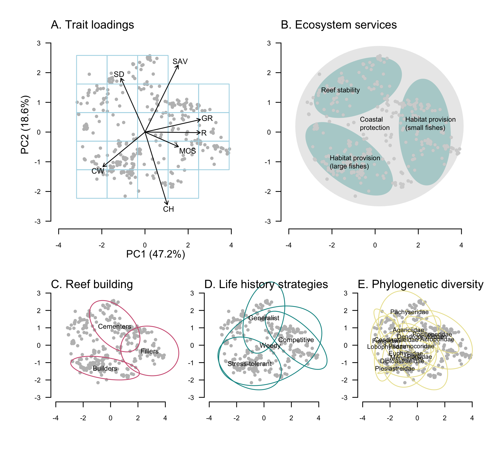

# Selecting coral species for reef restoration

This GitHub repository contains the species hedging approach outlined in the Perspective piece in *Journal of Applied Ecology* found [here](https://doi.org/?).

The data are compiled from existing sources as outlined in the paper. 

### Abstract

1. Humans have long sought to restore species but little attention has been directed at how to best select a subset of foundation species for maintaining rich assemblages that support ecosystems, like coral reefs and rainforests, which are increasingly threatened by environmental change. 
2. We propose a two-part hedging approach that selects optimized sets of species for restoration. The first part acknowledges that biodiversity supports ecosystem functions and services, and so it ensures precaution against loss by allocating an even spread of phenotypic traits. The second part maximizes species and ecosystem persistence by weighting species based on characteristics that are known to improve ecological persistence—e.g., abundance, species range and tolerance to environmental change.
3. Using existing phenotypic-trait and ecological data for reef building corals, we identified sets of ecologically persistent species by examining marginal returns in occupancy of phenotypic trait space. We compared optimal sets of species with those from the world’s southern-most coral reef, which naturally harbors low coral diversity, to show these occupy much of the trait space. Comparison with an existing coral restoration program indicated that current corals used for restoration only cover part of the desired trait space and programs may be improved by including species with different traits.
4. Synthesis and applications. While there are many possible criteria for selecting species for restoration, the approach proposed here addresses the need to insure against unpredictable losses of ecosystem services by focusing on a wide range of phenotypic traits and ecological characteristics. Furthermore, the flexibility of the approach enables the functional goals of restoration to vary depending on environmental context, stakeholder values, and the spatial and temporal scales at which meaningful impacts can be achieved. 

